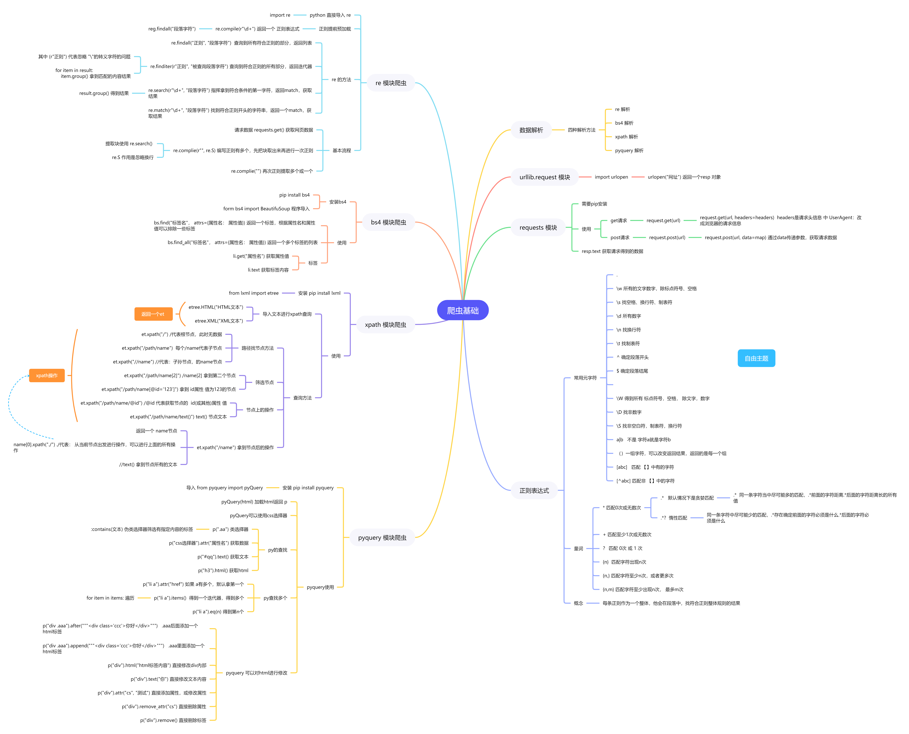

# requests 模块

模块安装

```
# 安装 requests
pip install requests
```

请求

```python
# get 请求
request.get(url, data=data, headers=headers)  

# post 请求
request.post(url, data=map)

# 返回内容
resp.text
```


# 数据解析

## re解析

```python
import re


# 预加载正则
reg = re.compile("", re.S)  # re.S 忽略换行
```

**查询**

```python
re.findall(r"正则", "查询字段") # 查询符合条件, 返回列表
re.finditer(r"正则", "查询字段") # 查询符合条件, 返回迭代器

re.search(r"\d+", "段落字符") #拿到符合条件的第一字符
re.match(r"\d+", "段落字符") #符合正则开头的字符串，返回一个match
```


### 正则

**概念:	**每条正则作为一个整体，他会在段落中，找符合正则整体规则的结果

#### 常用元字符

```
.     	# 任意字符
\w    	所有的文字数字，除标点符号、空格
\s 		找空格、换行符、制表符
\d 		所有数字
\n 		找换行符
\t 		找制表符
^ 		确定段落开头
$ 		确定段落结尾

\W 		得到所有 标点符号，空格， 除文字，数字
\D 		找非数字
\S 		找非空白符，制表符，换行符
a|b   	不是 字符a就是字符b
()		一组字符，可以改变返回结果，返回的是每一个组
[abc]   匹配 【】中有的字符
[^abc] 	匹配非 【】中的字符
```


#### 量词

```
* 		匹配0次或无数次
.*   	多个任意字符匹配更多
.*?  	多个任意字符惰性匹配
.+ 		匹配至少1次或无数次
? 		匹配 0次 或 1 次
{n}  	匹配字符出现n次
{n,} 	匹配字符至少n次，或者更多次
{n,m} 	匹配字符至少出现n次， 最多m次
```


## xpath 解析

```python
# 安装 lxml
pip install lxml
```

初始化

```python
from lxml import etree

# 返回一个可以 xpath对象 
et = etree.HTML("HTML文本")
etree.XML("XML文本")
```

使用

```python
et.xpath("/") # /代表根节点，此时无数据
et.xpath("/path/name")  # 每个/name代表子节点
et.xpath("/path/name[2]") # /name[2] 拿到第二个节点

et.xpath("/path/name[@id='123']") # 拿到 id属性 值为123的节点
et.xpath("/path/name/@id") # /@id 代表获取节点的  id(或其他)属性 值0
et.xpath("/path/name/text()") # text() 获取节点文本


name = et.xpath("/path/name[1]")
name.xpath("./") # 从name 节点出发查询

et.xpath("/path/name//text()") # // 间隔任意标签查询, //text() 拿到所有文本
```


## bs4 解析

```python
pip install bs4

from bs4 import BeautifuSoup
```

**使用**

```python
bhtml = BeautifuSoup("html文本")


bhtml.find("标签", attrs={属性名: 属性值}) # 返回一个符合条件的标签

li = bhtml.find_all("标签", attrs={属性名: 属性值}) # 返回多个符合条件的标签

li.get("属性名") # 返回属性值
li.text  #获取文本
```


## pyquery 解析

```python
# 安装
pip install pyquery

from pyquery import pyQuery
```

**使用**

```python
phtml = pyQuery(html)

phtml(".ad") #类选择器
phtml(".ad:contains(文本)") #查询类中文本 符合条件的

phtml("css选择器").attr("属性") # 获取属性值
p("#qq").text() #获取文本
p("h3").html() 	#获取html
```

**选择器**

```python
p("li a") 			#如果 a有多个，默认拿第一个

p("li a").items() 	#拿到多个a , 迭代器 
p("li a").eq(n) 	#得到第n个
```

**添加内容**

```python
p("div .aaa").after("""<div class='ccc'>你好</div>""")   #.aaa同级后面添加一个html标签

p("div .aaa").append("""<div class='ccc'>你好</div>""")  # .aaa里面添加一个html标签

p("div").html("html标签内容") #直接修改div内部html

p("div").text("你") #直接修改文本内容

p("div").attr("cs", "测试") #直接添加属性，或修改属性

p("div").remove_attr("cs") #直接删除属性

p("div").remove() 		#直接删除标签
```


