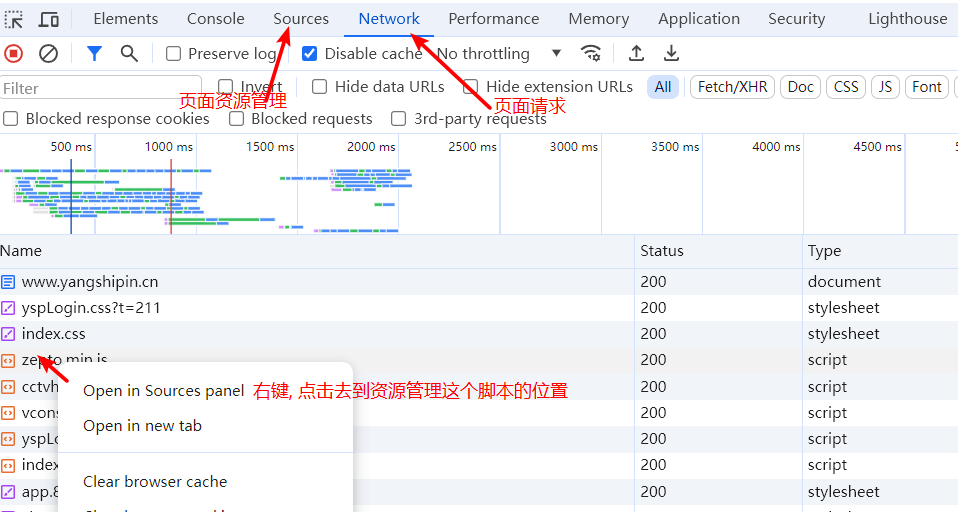
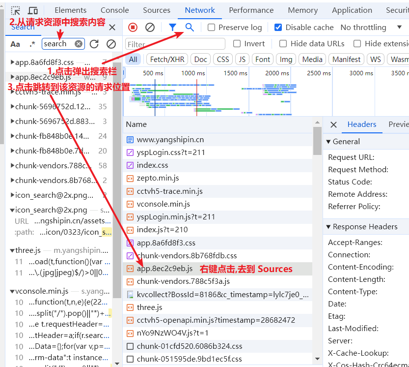
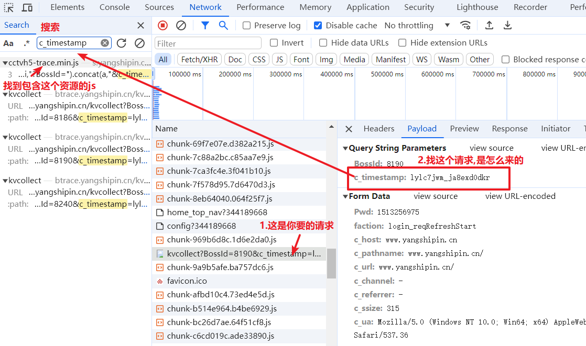
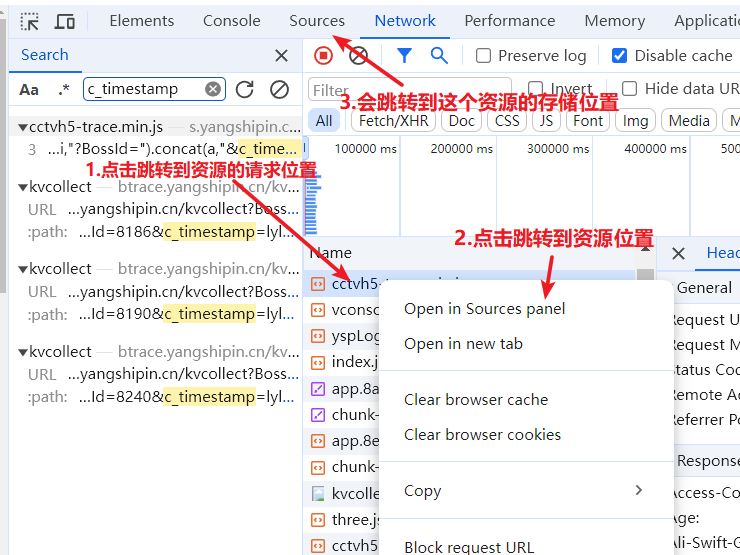
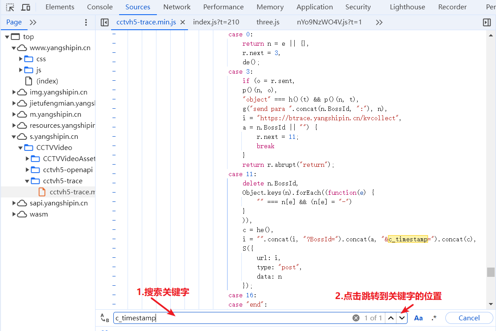
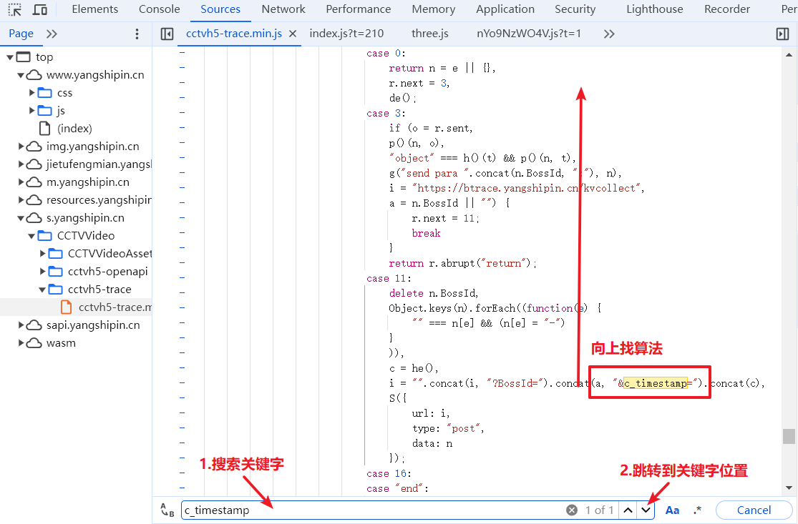
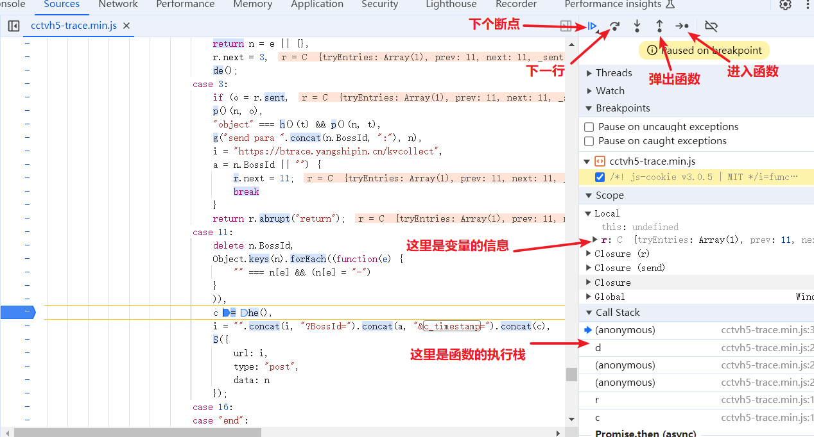
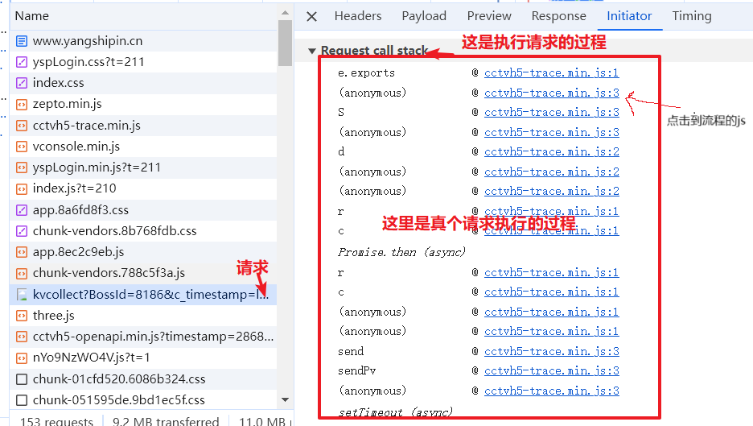
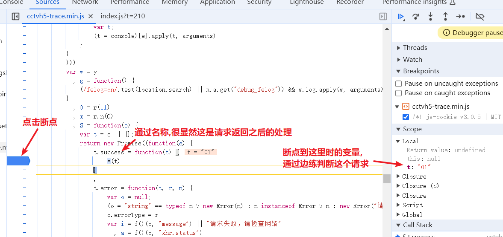

# 数据才是目标

点击network , 找到你要的请求,这个需要通过区分去找, 

你要的算法通常在,你要的请求里面, 或者在请求上面的资源里面

怎么搜索你要的关键字, 在那个资源里面

注意**: 区分请求和资源, 不要在请求中找算法**

## 案例1: 

去到数据请求, 查询必要请求资源

跳转到资源查询算法

## 案例2

注意: 

请根据请求判断: 算法加密

* 请求的 请求头和请求体有加密
  * 那么这个请求的加密
  * 在请求之前的流程上
* 请求后的数据有加密的数据
  * 那么请求的加密
  * 在请求之后的success执行之后函数里面